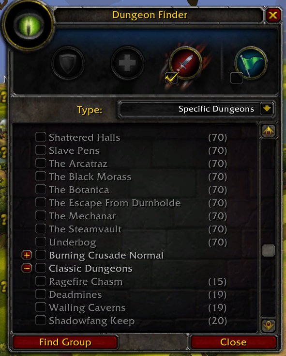
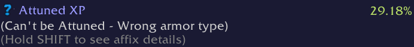

ScootsUITweaks 1.2.0.

## Description ##

This is a collection of small tweaks the user interface.

Features:
- Dungeon finder will remember which type you had selected between reloads / relogs.
- Dungeon finder will display dungeon challenge levels in the "specific dungeons" list.
- For users with the TomTom addon installed, a button to automatically convert pins added via the world map tracking panel to waypoints is added to the tracking panel.
- Displays a race/class combination on all the attuneable starting grey items.
- For prestiged players with an attune mastery greater than 0%, item tooltips for non-soulbound attuneable items of the "wrong type" will display their attunement progress.
- For prestiged players, alt-clicking on an item on the item tracker will automatically call the `.coerceitem` command for that item.

## Installation ##

Download this repository, then extract the `ScootsUITweaks` subdirectory from the `src` directory into your `World of Warcraft/Interface/AddOns` directory.

## Screenshots ##

## Support ##

If you'd like to show support for my addons you can use the button below.

Please do not feel obligated to do so - especially if you are not in a financially secure position - and please don't give beyond your means.

